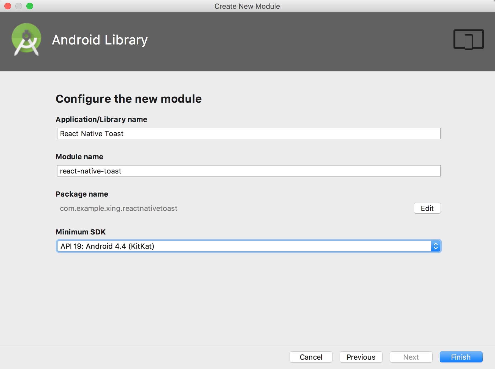

# How to write a react-native module

> 如何编写一个`react-native`依赖包，并支持`ios`和`android`平台。

- [【react-native原生模块 * 基础概念】](https://github.com/Xing-He/react-native-native-module)

## 当前版本

- react-native: `0.55.4`

## 目录

- [react-native项目中创建依赖模块](#react-native项目中创建依赖模块)
- [创建Npm依赖模块](#创建npm依赖模块)

## react-native项目中创建依赖模块

这种方式是参照 React Native 文档方法，在项目的 android 根文件夹下添加原生模块，会出现两个问题：
- 一是，如果要实现的原生模块多了，Android Library 也会递增，目录容易混乱难以管理；
- 二是，这样的原生模块不容易复用，其它项目没法直接使用这个原生模块。

通常的做法是，将实现后原生模块打包好，然后存放在项目的 node_modules 的文件内，供 APP 调用；这就是下边的第二种方式 [创建Npm依赖模块](#创建npm依赖模块)

### 初始化工程

```shell
react-native init toast
```

### 基础目录结构

```shell
# 使用tree命令
tree -I '*node_module*' -L 2
```

```
.
├── App.js
├── README.md
├── android
│   ├── app
│   ├── build.gradle
│   ├── gradle
│   ├── gradle.properties
│   ├── gradlew
│   ├── gradlew.bat
│   ├── keystores
│   └── settings.gradle
├── app.json
├── index.js
├── ios
│   ├── build
│   ├── toast
│   ├── toast-tvOS
│   ├── toast-tvOSTests
│   ├── toast.xcodeproj
│   └── toastTests
├── package-lock.json
└── package.json
```

#### Android开发步骤

> 使用`Android Studio`打开项目`android`目录。

##### Step 1

选择 `File` -> `New` -> `New Module` -> `Android Library`,并填写模块名称、包名以及支持的最低版本...  -> `Finish` 。



然后你会发现在`android`目录下会多出刚才创建的模块目录`react-native-toast`  

```shell
.
└── android
    ├── app
    └── react-native-toast
        ├── libs # 依赖包目录
        ├── src  # 源码目录
        └── build.gradle # 编译配置文件
```


##### Step 2

- 在`build.gradle`配置`react-native`依赖jar包

> 在`dependencies`中加入`compile "com.facebook.react:react-native:+"` 配置  

```gradle
dependencies {
    ...
    compile "com.facebook.react:react-native:+"
}
```

##### Step 3

编写native模块(Java代码)，并导出使用，详细步骤参考 [【react-native原生模块 * 基础概念】](https://github.com/Xing-He/react-native-native-module)

## 创建Npm依赖模块

### 安装模块创建工具

- [react-native-create-library](https://github.com/frostney/react-native-create-library) 
> creates a React Native library for different platforms

通过`react-native-create-library`工具可以帮助我们创建一个干净的`ios` 和 `android` Lib工程

```shell
npm install -g react-native-create-library
```

通过help参数可以查看具体参数：

```shell
react-native-create-library --help
```

### 创建模块

```shell
react-native-create-library --platforms ios,android # 我只创建ios和Android平台的
```

### 目录结构

```shell
.
├── README.md
├── android
│   ├── build.gradle
│   └── src
│       └── main
│           ├── AndroidManifest.xml
│           └── java
│               └── com
│                   └── reactlibrary
│                       ├── RNToastsModule.java
│                       └── RNToastsPackage.java
├── index.js
├── ios
│   ├── RNToasts.h
│   ├── RNToasts.m
│   ├── RNToasts.podspec
│   └── RNToasts.xcodeproj
│       └── project.pbxproj
└── package.json
```

### 编写代码

编写native模块(Java、Obj-c 代码)，并导出使用，详细步骤参考 [【react-native原生模块 * 基础概念】](https://github.com/Xing-He/react-native-native-module)

### 发布测试

通过npm发布依赖包

*本地开发的时候`不能`使用`npm link`的方式链接开发模块，路径会找不到。因此需要拷贝或直接在node_modules下开发*

## 参考文档

- [如何在 React Native 中写一个自定义模块](https://www.jianshu.com/p/73ef53244a7b)
- [React-Native系列》38、 ReactNative混合组件封装](https://blog.csdn.net/codetomylaw/article/details/52787404)
- [Android Studio制作library（图解）](https://blog.csdn.net/u013986975/article/details/70160791)
- [前端知识 | React-Native如何自己撸第三方库之android篇](https://www.jianshu.com/p/85bfb44c327c)
- [React Native 进阶之原生 UI 组件封装详解](https://juejin.im/entry/5724249671cfe400576a21f9)
- [Writing Android component for React Native](https://medium.com/@sejoker/writing-android-component-for-react-native-e34802bf3377)
- [Native Modules for React Native Android](https://shift.infinite.red/native-modules-for-react-native-android-ac05dbda800d)
- [CREATING A REACT NATIVE BRIDGE LIBRARY](https://shellmonger.com/2018/01/19/creating-a-react-native-bridge-library/)
- [React Native Android原生模块开发实战|教程|心得](http://www.devio.org/2017/01/22/React-Native-Android%E5%8E%9F%E7%94%9F%E6%A8%A1%E5%9D%97%E5%BC%80%E5%8F%91%E5%AE%9E%E6%88%98-%E6%95%99%E7%A8%8B-%E5%BF%83%E5%BE%97/)
- [React Native iOS原生模块开发实战|教程|心得](http://www.devio.org/2017/01/22/React-Native-iOS%E5%8E%9F%E7%94%9F%E6%A8%A1%E5%9D%97%E5%BC%80%E5%8F%91%E5%AE%9E%E6%88%98-%E6%95%99%E7%A8%8B-%E5%BF%83%E5%BE%97/)
